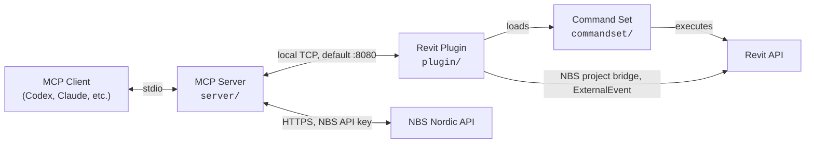
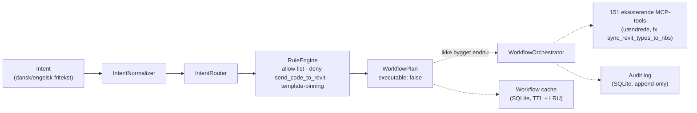

[](https://github.com/Elprofessor1990/revit-mcp-server-nbs-nordic)

# Revit MCP + NBS Nordic

**Connect AI assistants to Revit models and NBS Nordic projects through one MCP server.**

**Dansk:** [Kom godt i gang — trin for trin](docs/kom-godt-i-gang.md).

---

This edition extends Revit automation with model-specific NBS project connections, classification lookup, and controlled type/instance linking. Codex, Claude and other local MCP clients can use the same server. The current tool schema contains **151 tools** (September 2026); the client-discovered tool list is authoritative.

> [!NOTE]
> Based on [LuDattilo/revit-mcp-server](https://github.com/LuDattilo/revit-mcp-server) and the original [revit-mcp](https://github.com/mcp-servers-for-revit/revit-mcp) project. This is an independent integration, not an official NBS Nordic product. Upstream installers and the upstream npm package are not a verified distribution of this edition.

## Key Features

- **Revit tools** — project info, model health, clash detection, element CRUD, batch operations, data export (PDF/DWG/IFC/CSV)
- **NBS setup inside Revit** — save your NBS key, choose a project, and prepare the model's NBS fields under Settings → NBS Nordic
- **Connection starts automatically by default** — optional manual start/stop; this does not automatically synchronize data
- **Explicit linking modes** — Type Only, Instance Only, or Type and Instance, with a dry run before changes
- **Native NBS compatibility** — prepares 13 core parameters, including project settings; preserves existing native options
- **Revit 2027 verified for this update** — older build targets remain in the codebase but have not been revalidated for these NBS changes
- **Language-independent** — works with any Revit UI language (English, Italian, French, German, etc.) using BuiltInCategory resolution
- **Built-in Claude chat panel** — dockable panel inside Revit with direct AI access (Anthropic API, extended thinking enabled)
- **Real-time execution** — AI requests are executed immediately on the active model via TCP/JSON-RPC 2.0
- **Extensible command set** — add new commands without modifying the plugin core

## Architecture



| Component | Language | Role |
|-----------|----------|------|
| **MCP Server** (`server/`) | TypeScript | Revit tool calls over local TCP; NBS API calls over HTTPS |
| **Revit Plugin** (`plugin/`) | C# | Automatic connection, settings UI, command dispatch and model-specific NBS parameter bridge |
| **Command Set** (`commandset/`) | C# | Implements Revit API operations, returns structured results |

## Tool-Agent architecture (in progress)

The next layer being built on top of the MCP server: a routing/planning step that maps a natural-language intent (Danish or English) to one of a small set of reviewed, deterministic workflows built from the *existing* 151 tools — instead of an AI client picking tools ad hoc for every request. It never invents a tool, never runs `send_code_to_revit` automatically, and never expands what it was asked to do.



Solid arrows are implemented; dashed arrows are designed but not built yet.

| Status | What |
|---|---|
| **Implemented, behind a feature flag** (`REVIT_MCP_TOOL_AGENT_ENABLED`, default **off**) | Intent normalization for four reference workflows (wall height, wall schedule, type renaming, NBS classification sync), a rule engine that pins each plan to its reviewed template and denies anything else, a tool-contract snapshot test that proves the flag being off leaves all 151 existing tools byte-for-byte unchanged, and separate SQLite-backed workflow-cache/audit-log stores. |
| **Designed, not built** | An agent entrypoint that can actually be called by an MCP client, execution of a plan against live tools, cache feedback from real runs, and a live Revit end-to-end test. |

No client can reach this today — there is no registered tool for it yet, and the flag defaults off. Full design, gap analysis against the target architecture, and file-level references: [`docs/revit-nbs-agent-phase1-analysis.md`](docs/revit-nbs-agent-phase1-analysis.md). Running status: [`docs/nbs-integration-worklog.md`](docs/nbs-integration-worklog.md).

## Requirements

### To use

| Requirement | Details |
|-------------|---------|
| **Node.js** | 18+ (for the MCP server) |
| **Autodesk Revit** | Use 2027 for the currently verified NBS update |
| **OS** | Windows 10/11 (Revit is Windows-only) |
| **Anthropic API key** (optional) | Required only for the built-in chat panel. Set via `%USERPROFILE%\.claude\api_key.txt` or env `ANTHROPIC_API_KEY` |
| **NBS Nordic** (for NBS features) | NBS account/API key with project access, plus the official NBS Revit addin and its shared-parameter file for model setup |

An external MCP client uses its own AI authentication. It does not need an Anthropic key merely to use this server. Never put an NBS key in chat, screenshots, model files or Git. Settings saves it locally in `%USERPROFILE%\.mcp-revit\nbs-config.json`; treat that file as a secret.

### To build from source

| Requirement | Details |
|-------------|---------|
| **Visual Studio 2022** | With .NET desktop development workload |
| **.NET Framework 4.8 SDK** | For Revit 2023-2024 builds |
| **.NET 8 SDK** | For Revit 2025-2026 builds |
| **.NET 10-compatible SDK** | For the Revit 2027 target; see the project's build configuration |
| **Node.js 18+** | For the MCP server |
| **Revit API assemblies** | Installed with Revit (referenced automatically via NuGet) |

## Quick Start

### 1. Install the Revit plugin

#### Use this edition, not the upstream one-line installer

The September 2026 NBS changes were built and installed locally on Revit 2027. A successful Git push is **not** evidence that an updated ZIP or npm package has been published. Do not use the upstream installer to obtain this edition.

For a source checkout, first build the local server from this repository:

```powershell
git clone https://github.com/Elprofessor1990/revit-mcp-server-nbs-nordic.git
cd revit-mcp-server-nbs-nordic/server
npm ci
npm run build:local
cd ..
```

For an **existing complete Revit 2027 installation**, save and close Revit, build the updated plugin, then run the checked update script from the repository root:

```powershell
dotnet build plugin/RevitMCPPlugin.csproj -c "Release R27"
.\scripts\install-nbs-update.ps1
```

The updater backs up and hash-checks six existing files (plugin DLL/PDB, tool schema and three server runtime files). It preserves the command registry and does not replace the official NBS addin. `-PluginOnly` updates only the MCP DLL/PDB; `-ServerOnly` updates only the server and schema. It is **not a first-time installer** and does not update commandset DLLs. Restart Revit after a DLL update and restart/reconnect the AI client's MCP server after a server/schema update.

#### First-time installation

> [!IMPORTANT]
> A complete deployment needs the compiled plugin, command set, dependencies and manifests. Source `.cs` files alone cannot load in Revit. Use a complete build from this repository; see [Development](#development). The incremental updater above cannot create a missing base installation. First-time deployment of this NBS edition on a clean machine has not yet been smoke-tested.

Place a complete, version-matched deployment in:

```
%AppData%\Autodesk\Revit\Addins\<your Revit version>\
```

To open this folder quickly, press `Win+R` and type:
```
%AppData%\Autodesk\Revit\Addins
```

The core layout is illustrated below for Revit 2027 (additional dependencies must also be included):

```
Addins/2027/
├── mcp-servers-for-revit.addin          <-- manifest file (required)
└── revit_mcp_plugin/                    <-- subfolder (required)
    ├── RevitMCPPlugin.dll               <-- main plugin (required)
    ├── RevitMCPSDK.dll                  <-- SDK dependency (required)
    ├── Newtonsoft.Json.dll              <-- JSON dependency (required)
    ├── tool_schemas.json
    └── Commands/
        ├── commandRegistry.json
        └── RevitMCPCommandSet/
            ├── command.json
            └── 2027/
                ├── RevitMCPCommandSet.dll
                └── ...
```

> [!WARNING]
> If `RevitMCPPlugin.dll` is missing or the `revit_mcp_plugin/` subfolder is not present, the plugin will not load. Check that you extracted the **contents** of the ZIP, not the ZIP file itself.

### 2. Configure the MCP server

Point the client to **this checkout's built `server/build/index.js`**, not `npx -y mcp-server-for-revit`. Replace `C:/Projects/revit-mcp-server-nbs-nordic` in the examples with your actual checkout path. `node` must be available to the client; use its absolute executable path if needed. Keep `index.js`, `sql-wasm.wasm` and `cci-hierarchy.json` together in `server/build/`.

**Codex**

```powershell
codex mcp add revit-mcp-nbs -- node "C:/Projects/revit-mcp-server-nbs-nordic/server/build/index.js"
```

Alternatively, merge this entry into `%USERPROFILE%\.codex\config.toml` without replacing your other settings:

```toml
[mcp_servers.revit-mcp-nbs]
command = "node"
args = ["C:/Projects/revit-mcp-server-nbs-nordic/server/build/index.js"]
```

Use one configuration method, not both. See [OpenAI's MCP documentation](https://learn.chatgpt.com/docs/extend/mcp?surface=cli) for client configuration.

**Claude Code**

```bash
claude mcp add revit-mcp-nbs -- node "C:/Projects/revit-mcp-server-nbs-nordic/server/build/index.js"
```

**Claude Desktop**

Claude Desktop → Settings → Developer → Edit Config → `claude_desktop_config.json`:

```json
{
    "mcpServers": {
        "revit-mcp-nbs": {
            "command": "node",
            "args": ["C:/Projects/revit-mcp-server-nbs-nordic/server/build/index.js"]
        }
    }
}
```

### 3. Start Revit

Restart/reconnect the MCP client after configuring it. Open Revit and save a test model before making changes. The local Revit connection starts automatically by default. You can disable this in Settings → Forbindelse using **“Start forbindelsen automatisk, når Revit åbner”**.

The plugin loads automatically. In the **Add-Ins** ribbon tab you should see **three buttons** in the "Revit MCP Plugin" panel:

| Button | Function |
|--------|----------|
| **Revit MCP Switch** | Manually toggle the local connection; clicking while connected stops it |
| **MCP Panel** | Show/hide the built-in chat panel |
| **Settings** | Connection settings, NBS key/project setup, and command selection |

Do not click the Switch just because an older guide says to: automatic startup may already have connected it. Ask the AI to run `get_connection_status` and verify the active model. Revit connectivity and NBS account/project connectivity are separate checks.

> [!TIP]
> If you only see the **Switch** button but not **MCP Panel** or **Settings**, the plugin did not load correctly. See [Troubleshooting](#troubleshooting) below.

### 4. Connect the model to NBS Nordic

1. Install the official NBS Nordic addin for your Revit version if it is not already installed. Its official shared-parameter definitions are required by the MCP model setup.
2. In **MCP Settings → NBS Nordic**, enter the NBS API key and click **“Forbind NBS og hent projekter”**.
3. Choose the intended NBS project and click **“Forbind projekt og klargør NBS-felter”**.
4. Save the RVT. The project ID belongs to this model, not a global default.
5. Run `get_connection_status` again. Check the model, project and missing parameter bindings. Empty element values are normal until elements are linked to actual NBS components.

Setup provisions 13 core project/type/instance fields, including `NBS Override` and `NBS Project Date`. It preserves valid native settings. It does not create building components or automatically run native Sync Now. Existing linked models are not silently migrated to another project.

### 5. Preview before synchronizing

Ask: **“Show a dry run for the walls using Type and Instance. Do not change anything yet.”**

The tool is `sync_revit_types_to_nbs`, with required `linkMode` and `dryRun: true`:

| Mode | What is updated after approval |
|---|---|
| `typeOnly` | NBS type parameters only |
| `instanceOnly` | NBS instance parameters only; instances of one type can have separate links |
| `typeAndInstance` | Both levels, preserving independently linked instances |

Unlinked instances do not inherit a type link unless `inheritTypeForUnlinkedInstances` is explicitly requested. Ambiguous matches need an explicit mapping. Preview first, confirm the target model/project and mappings, then request `dryRun: false`.

**MCP linking is not NBS' native Sync Now.** The MCP tool reads NBS component data and writes supported Revit parameters; it does not perform the native addin's full model upload/two-way workflow. Native settings are controlled by NBS' own UI. Upload tools such as `nbs_push_quantities` and `nbs_push_schedule` are separate external writes. Automatic MCP connection does not enable periodic synchronization.

## NBS tools and current status

| Tools | Purpose / limitation |
|---|---|
| `get_connection_status` | Check Revit, active model, NBS access/project and bindings without exposing keys |
| `nbs_list_projects`, `nbs_get_project` | Read accessible projects and their classification settings |
| `nbs_connect_project` | Set the model's project and prepare official fields; save the RVT afterwards |
| `nbs_list_components`, `nbs_list_instances` | Read existing NBS records |
| `sync_revit_types_to_nbs` | Preview/apply explicit type and instance linking |
| `nbs_lookup_classification` | Search a static CCI reference; not a code allocator or a project-validated result |
| `nbs_clone_project` | Clone an existing NBS project (documented Pro operation); mock-tested, not live creation-tested |
| `nbs_create_component` | Works via `/api/v1` (the documented v2 route 404s). Rejects a classificationcode with a serial embedded (e.g. `[L]%AD130`) before sending — NBS silently truncates those instead of erroring. `classificationserial` cannot be set; NBS assigns it and duplicates across quick successive creates are possible — check the returned serial. |
| `nbs_get_documents` | Read NBS documents; not document/section authoring |
| `nbs_push_quantities`, `nbs_push_schedule` | Separate uploads; require an intentional request |

Native Sync Now succeeded in an existing repaired Revit 2027 model before the permanent plugin update. The updated DLL/PDB installation is hash-verified. **The clean/new-project test after restart remains pending.** See the [NBS integration worklog](docs/nbs-integration-worklog.md) for current status, and [update history](docs/archive/2026-09-09-nbs/nbs-update-2026-09-09.md) / [native-sync repair](docs/archive/2026-09-09-nbs/nbs-native-sync-repair-2026-09-09.md) for the raw verification records.

### Classification and student naming

The bundled lookup has 240 groups and 922 entries derived from Region Syddanmark's IKT list dated 2023-07-12. It is a specific reference, not a universal naming policy. Check the NBS project's classification system and separator before using a result. For example, reference main type `[L]%AD230` means “Skillevæg, Skeletkonstruktion”; it is not wall instance number 230.

Keep classification/main type, descriptive Revit type name, and individual element ID separate. Do not generate `.001`–`.050` as purported NBS links unless the corresponding NBS components actually exist. A student-facing naming wizard, model checker and practice mode are **proposals, not implemented features**. See the [Danish guide](docs/kom-godt-i-gang.md#navngivning-og-klassifikation).

## Supported Revit Versions

| Version | .NET Target | Status | Notes |
|---------|-------------|--------|-------|
| **Revit 2023** | .NET Framework 4.8 | Build target retained | NBS changes not revalidated |
| **Revit 2024** | .NET Framework 4.8 | Build target retained | NBS changes not revalidated |
| **Revit 2025** | .NET 8 | Build target retained | NBS changes not revalidated |
| **Revit 2026** | .NET 8 | Build target retained | NBS changes not revalidated |
| **Revit 2027** | .NET 10 | Build and scoped tests passed | New-project/post-restart smoke test pending |

The command set uses compile-time constants for API differences. A retained build configuration does not establish that every tool or NBS workflow has been tested on that version.

## Revit tool reference

### Project & Model Info

| Tool | Description |
| ---- | ----------- |
| `get_project_info` | Project metadata, levels, phases, links, worksets |
| `get_current_view_info` | Active view type, name, scale, detail level |
| `get_current_view_elements` | Elements from the active view filtered by category |
| `get_selected_elements` | Currently selected elements |
| `get_available_family_types` | Family types filtered by category |
| `get_element_parameters` | All instance and type parameters for elements |
| `get_warnings` | Model warnings and errors |
| `get_phases` | Phases and phase filters |
| `get_worksets` | Workset info and status |
| `get_shared_parameters` | Project parameters bound to categories |
| `manage_links` | List, reload, or unload linked Revit models |

### Model Analysis & Auditing

| Tool | Description |
| ---- | ----------- |
| `ai_element_filter` | Intelligent element query by category, type, visibility, bounding box |
| `analyze_model_statistics` | Element counts by category, type, family, and level |
| `check_model_health` | Health score (0-100), grade (A-F), actionable recommendations |
| `clash_detection` | Geometric intersection detection between element sets |
| `measure_between_elements` | Distance measurement (center-to-center, closest points, bounding box) |
| `get_elements_in_spatial_volume` | Find elements within a 3D bounding region |

### Materials & Quantities

| Tool | Description |
| ---- | ----------- |
| `get_materials` | List materials filtered by class or name |
| `get_material_properties` | Physical, structural, and thermal properties |
| `get_material_quantities` | Material takeoffs: area, volume, element counts |

### Element Creation

| Tool | Description |
| ---- | ----------- |
| `create_line_based_element` | Walls, beams, pipes (start/end points) |
| `create_point_based_element` | Doors, windows, furniture (insertion point) |
| `create_surface_based_element` | Floors, ceilings, roofs (boundary) |
| `create_floor` | Floors from boundary points or room boundaries |
| `create_room` | Rooms at specified locations |
| `create_grid` | Grid systems with automatic spacing |
| `create_level` | Levels at specified elevations |
| `create_structural_framing_system` | Beam framing systems within a boundary |
| `create_array` | Linear or radial arrays of elements |

### Element Modification

| Tool | Description |
| ---- | ----------- |
| `modify_element` | Move, rotate, mirror, or copy elements |
| `operate_element` | Select, hide, isolate, highlight, delete |
| `change_element_type` | Batch swap family types |
| `set_element_parameters` | Write parameter values on elements |
| `set_element_phase` | Change element phase assignment |
| `set_element_workset` | Change element workset assignment |
| `match_element_properties` | Copy parameters from source to target elements |
| `copy_elements` | Copy elements between views |
| `delete_element` | Delete elements by ID |
| `load_family` | Load a family file (.rfa) into the project |

### Views & Sheets

| Tool | Description |
| ---- | ----------- |
| `create_view` | Create floor plans, sections, elevations, 3D views |
| `duplicate_view` | Duplicate views (independent, dependent, with detailing) |
| `create_view_filter` | Create, apply, or list view filters |
| `apply_view_template` | List, apply, or remove view templates |
| `override_graphics` | Per-element graphic overrides (color, transparency, lineweight) |
| `color_elements` | Color elements by parameter value |
| `create_sheet` | Create sheets with title blocks |
| `batch_create_sheets` | Create multiple sheets at once |
| `place_viewport` | Place views onto sheets |
| `create_schedule` | Create schedule views with fields, filters, sorting |
| `create_revision` | List, create, or add revisions to sheets |

### Annotation

| Tool | Description |
| ---- | ----------- |
| `create_dimensions` | Dimension annotations between elements or points |
| `create_text_note` | Text note annotations in views |
| `create_filled_region` | Hatched/filled regions in views |
| `tag_all_walls` | Auto-tag all walls in the active view |
| `tag_all_rooms` | Auto-tag all rooms in the active view |

### Data Export

| Tool | Description |
| ---- | ----------- |
| `export_room_data` | All room data (area, volume, department, finishes) |
| `export_elements_data` | Bulk element data export with filtering (JSON/CSV) |
| `export_schedule` | Export schedules to CSV/TXT files |
| `get_schedule_data` | Read schedule contents or list all schedules |
| `batch_export` | Export sheets/views to PDF, DWG, or IFC |

### Batch Operations & Cleanup

| Tool | Description |
| ---- | ----------- |
| `batch_rename` | Batch rename views, sheets, levels, grids, rooms |
| `renumber_elements` | Sequential renumbering of rooms, doors, windows |
| `sync_csv_parameters` | Write parameter values back from CSV/AI data |
| `purge_unused` | Identify and remove unused families, types, materials |
| `cad_link_cleanup` | Audit and clean up CAD imports and links |
| `add_shared_parameter` | Add shared parameters to categories |

### Advanced

| Tool | Description |
| ---- | ----------- |
| `send_code_to_revit` | Execute C# code inside Revit. Variables: `document` (Document), `parameters` (object[]). Auto-imports: System, System.Linq, Autodesk.Revit.DB/UI, System.Collections.Generic. Use `return` to send results. Mode `auto` wraps in Transaction, `none` for manual |
| `store_project_data` | Store project metadata in local database |
| `store_room_data` | Store room metadata in local database |
| `query_stored_data` | Query stored project and room data |
| `say_hello` | Display a greeting dialog (connection test) |

## Built-in Chat Panel

The Revit plugin includes a dockable chat panel that connects directly to the Anthropic API. It provides a Claude chat interface inside Revit where the AI can autonomously execute tools on the active model.

- **Model**: Claude Sonnet 4.6 with extended thinking (10K token budget)
- **System prompt**: Autonomous mode — Claude executes actions directly without unnecessary confirmations
- **Features**: Tool execution feedback, thinking summary, round progress, stop/cancel, chat export (TXT/MD/JSON)

## Known Limitations

| Limitation | Details |
|------------|---------|
| **Windows only** | Revit runs only on Windows; macOS/Linux are not supported |
| **Single model** | The plugin operates on the active document only; background documents are not accessible |
| **Local TCP connection** | Default port 8080, with fallback to the next nine ports; the client reads the plugin's port file. Multiple running Revit sessions require care to avoid targeting the wrong model |
| **Undo scope** | Revit parameter sync uses a transaction, but there is no universal undo across a sequence of tools or external NBS API writes |
| **`send_code_to_revit`** | May fail if third-party addins cause assembly conflicts (e.g., duplicate DLL references) |
| **Parameter names are localized** | Revit parameter names depend on UI language. Use BuiltInCategory names (e.g., `OST_Walls`) for categories. The command set resolves categories automatically, but parameter names must match the Revit language |
| **No streaming** | Tool results are returned as a single response; large results (e.g., exporting thousands of elements) may take time |
| **Anthropic API key** | The built-in chat panel requires an Anthropic API key. External MCP clients (Claude Code, Claude Desktop) use their own authentication |

## Troubleshooting

### Only the Switch button appears (no MCP Panel or Settings)

**Possible cause:** Missing dependencies, a mixed-version installation or a startup error. Check the plugin log before changing files.

**Fix:**

1. Close Revit
2. Back up only this plugin's manifest, `revit_mcp_plugin` folder and command settings; do not delete the version's entire Addins folder
3. Obtain a complete build of this edition for the correct Revit version
4. Verify the folder structure against [Step 1](#1-install-the-revit-plugin), preserving other addins and local settings
5. Restart Revit

### Plugin does not appear in Add-Ins tab

- Verify that `mcp-servers-for-revit.addin` exists directly inside `%AppData%\Autodesk\Revit\Addins\<version>\` (not in a subfolder)
- Verify the ZIP version matches your Revit version (e.g., Revit2025 ZIP for Revit 2025)
- Check that Revit did not block the DLLs: right-click each `.dll` → Properties → if you see "Unblock" at the bottom, check it and click OK

### Connection refused or the new NBS tools are missing

- Ensure Revit is open and check whether automatic connection is enabled. Do not toggle an already running connection off.
- Confirm the MCP client starts this checkout's `server/build/index.js`, not the upstream npm package.
- Restart the client's MCP connection after updating the server/schema. Check for `get_connection_status` and `nbs_connect_project`.
- If a manual `REVIT_MCP_PORT` override is configured, verify it matches the intended Revit instance. Otherwise let the server discover the port file.
- Use `get_connection_status` to distinguish Revit connection failures from NBS API/access errors.

### NBS says “Check the log for more information”

That message is generic; inspect the current log instead of assuming every occurrence has the same cause. Our verified case involved missing native project settings. Install the updated MCP plugin while Revit is closed, reopen the model, and use the NBS project connection to prepare missing fields. Save the RVT. Do not overwrite `NBS Override` through an ordinary element-parameter operation. See [the repair report](docs/archive/2026-09-09-nbs/nbs-native-sync-repair-2026-09-09.md).

### NBS fields are present but empty

Project connection prepares fields; it does not invent component links. List NBS components, inspect the type/instance links and run a dry run. Component creation returning HTTP 404 is a separate unresolved API problem, not proof that model connection failed.

### Other common issues

| Issue | Solution |
|-------|----------|
| "Element not found" | Verify element ID with `get_current_view_elements` |
| "Parameter not found" | Check exact name with `get_element_parameters` — names are localized |
| "Family type not found" | Use `get_available_family_types` for exact names |
| "Tool not available" in Claude Desktop | Restart Claude Desktop to refresh the MCP tool list |
| Timeout on large operations | Try with fewer elements or a simpler filter |

## Development

### MCP Server

```bash
cd server
npm ci
npm run build:check
npm run build:local
```

`build:local` bundles the server and copies its WASM/CCI runtime files without invoking the addins deployment script. The broader `npm run build` also runs deployment steps; review them before use. No npm publication is needed for the local MCP configuration above.

### Revit Plugin + Command Set

Open `mcp-servers-for-revit.sln` in Visual Studio. The solution contains both the plugin and command set projects. Build configurations target Revit 2023-2027:

| Configuration | Target | .NET |
|---------------|--------|------|
| `Debug R23` / `Release R23` | Revit 2023 | .NET Framework 4.8 |
| `Debug R24` / `Release R24` | Revit 2024 | .NET Framework 4.8 |
| `Debug R25` / `Release R25` | Revit 2025 | .NET 8 |
| `Debug R26` / `Release R26` | Revit 2026 | .NET 8 |
| `Debug R27` / `Release R27` | Revit 2027 | .NET 10 |

Building the solution automatically assembles the complete deployable layout in `plugin/bin/AddIn <year> <config>/` — the command set is copied into the plugin's `Commands/` folder as part of the build.

**Debug builds also deploy to the user's Revit Addins directory and can replace the command registry.** Save and close Revit and back up the existing plugin/settings first. Release builds assemble output without installing it into that active directory. To assemble the R27 binaries explicitly, build both projects in order:

```powershell
dotnet build plugin/RevitMCPPlugin.csproj -c "Release R27"
dotnet build commandset/RevitMCPCommandSet.csproj -c "Release R27"
```

Keep the compiled server from [Step 2](#2-configure-the-mcp-server) at the path configured in the AI client. The incremental updater preserves installed commandset binaries; it does not substitute for deploying a complete first-time build or updating changed command handlers.

## Testing

The NBS checks run without changing live Revit/NBS data:

```powershell
cd server
npm run test:nbs
npm run build:check
cd ..
dotnet run --project tests/nbs-compatibility/NbsCompatibility.Tests.csproj
```

Latest run: 19 NBS tests and 10 native-settings checks passed. These do not certify all 151 tools. For a new-model smoke test, follow the [Danish checklist](docs/kom-godt-i-gang.md#test-i-et-nyt-projekt). External uploads and project/component creation require separate approval and verification.

The test project uses [Nice3point.TUnit.Revit](https://github.com/Nice3point/RevitUnit) to run integration tests against a live Revit instance.

```bash
# Revit 2026
dotnet test -c Debug.R26 -r win-x64 tests/commandset

# Revit 2025
dotnet test -c Debug.R25 -r win-x64 tests/commandset
```

> **Note:** The `-r win-x64` flag is required on ARM64 machines because the Revit API assemblies are x64-only.

## Project Structure

```
mcp-servers-for-revit/
├── mcp-servers-for-revit.sln    # Combined solution (plugin + commandset + tests)
├── command.json                 # Command set manifest
├── server/                      # MCP server (TypeScript) - tools exposed to AI clients
│   └── src/tools/               # Tool registrations, including NBS
├── plugin/                      # Revit add-in (C#) - TCP bridge + chat panel
│   └── UI/                      # Dockable chat panel (XAML + code-behind)
├── commandset/                  # Command implementations (C#) - Revit API operations
│   ├── Commands/                # Command registration
│   ├── Services/                # Event handlers (one per tool)
│   └── Utils/                   # CategoryResolver, ProjectUtils, etc.
├── tests/                       # Integration tests (TUnit + live Revit)
├── assets/                      # Images for documentation
├── .github/                     # CI/CD workflows
├── LICENSE
└── README.md
```

## Releasing

A commit on `main` is not a packaged release. The inherited [release workflow](.github/workflows/release.yml) is intended to:

- Builds the Revit plugin + command set for Revit 2023-2027
- Creates a GitHub release with `mcp-servers-for-revit-vX.Y.Z-Revit<year>.zip` assets
- Publishes the MCP server to npm as [`mcp-server-for-revit`](https://www.npmjs.com/package/mcp-server-for-revit)

This edition has not verified publication of the latest NBS update through that pipeline. Repository permissions, Actions configuration and ownership of the npm package must be checked before tagging. Do not assume this repository can publish to the upstream package name. Use the local build instructions for the current version.

```powershell
# Bump version, commit, and tag
./scripts/release.ps1 -Version X.Y.Z

# Push to trigger CI
git push origin main --tags
```

## Acknowledgements

| | Credit | Link |
|---|--------|------|
| **Original concept** | **Roman Zarkhin** — created the first MCP server for Revit (15 tools) | [romanzarkhin/revit-mcp](https://github.com/romanzarkhin/revit-mcp) |
| **Expansion to 80+ tools** | **[mcp-servers-for-revit](https://github.com/mcp-servers-for-revit) community** — lisiting01, jmcouffin, huyan1458, bobbyg603, chuongmep and others expanded the project across three repos | [revit-mcp](https://github.com/mcp-servers-for-revit/revit-mcp), [revit-mcp-plugin](https://github.com/mcp-servers-for-revit/revit-mcp-plugin), [revit-mcp-commandset](https://github.com/mcp-servers-for-revit/revit-mcp-commandset) |
| **Consolidated repo** | **[sparx-fire](https://sparx-fire.com)** (Bobby Galli) — merged the three repos into a single solution | [mcp-servers-for-revit/mcp-servers-for-revit](https://github.com/mcp-servers-for-revit/mcp-servers-for-revit) |
| **Upstream maintainer** | **LuDattilo** — language-independent operation, embedded Claude chat panel, PowerShell installer | [LuDattilo/revit-mcp-server](https://github.com/LuDattilo/revit-mcp-server) |
| **NBS Nordic integration edition** | **Elprofessor1990** — model/project connection and NBS integration | [This repository](https://github.com/Elprofessor1990/revit-mcp-server-nbs-nordic) |

## License

This project is released under the **MIT License** — see [LICENSE](LICENSE) for the full text.

### What MIT allows

| | Allowed | Condition |
|---|---|---|
| Commercial use | Yes | Include copyright notice |
| Modification | Yes | Include copyright notice |
| Distribution | Yes | Include copyright notice |
| Private use | Yes | — |
| Sublicensing | Yes | Include copyright notice |

### Disclaimer of Liability

> **THE SOFTWARE IS PROVIDED "AS IS", WITHOUT WARRANTY OF ANY KIND.** The authors and contributors are not liable for any damages, data loss, model corruption, or unintended modifications to Revit projects arising from the use of this software. Use at your own risk.

**Important:**

- This software executes commands on live Revit models. Always work on copies or ensure you have backups before using AI-driven automation.
- The AI (Claude or other MCP clients) may misinterpret instructions and execute unintended operations. Review AI-generated actions before confirming batch operations on production models.
- This project is not affiliated with, endorsed by, or supported by Autodesk, Inc. "Autodesk" and "Revit" are registered trademarks of Autodesk, Inc.
